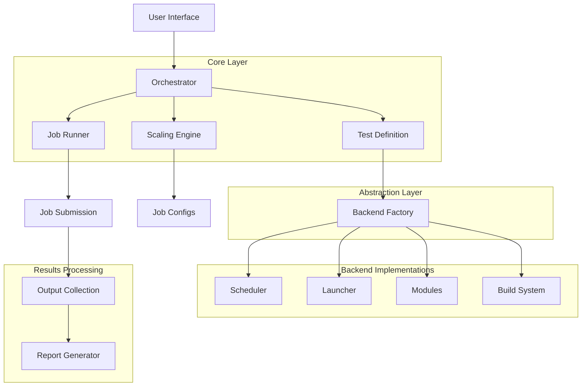

# HPC-ScaleTest

**A modular, production-ready Python framework for automated HPC scaling benchmarks with intelligent workload generation, multi-backend support, and publication-quality performance analysis.**

---

## 📋 About

HPC-ScaleTest is a comprehensive framework designed to simplify and automate the complex process of running scaling studies on High-Performance Computing systems. Whether you're evaluating strong scaling (fixed problem size) or weak scaling (problem size grows with resources), this framework handles:

- **🔄 Automated Workflow**: Clone → Build → Scale → Analyze with a single command
- **🧩 Pluggable Architecture**: Write tests once, run on any HPC system (Slurm, PBS, local)
- **📊 Intelligent Scaling**: Automatic 2D/3D weak scaling with correct incremental dimension growth
- **🎯 Zero Configuration**: Auto-detect build systems, dependencies, and optimal configurations
- **📈 Performance Reports**: Efficiency metrics, speedup analysis, and exportable JSON data
- **🖥️ Heterogeneous Support**: Seamless CPU and GPU resource management

### Key Capabilities

✅ **Minimal User Input**: Provide code repository → Get complete scaling analysis  
✅ **Backend Agnostic**: Same test runs on laptop, cluster, or supercomputer  
✅ **Correct Scaling Logic**: Baseline-preserving 2D/3D weak scaling with validated patterns  
✅ **Smart Build Detection**: Automatically handles Make, CMake, Autotools, Spack, EasyBuild  
✅ **Flexible Job Control**: Auto-submit jobs or generate scripts for manual review  
✅ **Publication Ready**: Export efficiency reports in text and JSON formats  

---

## 🏗️ Architecture & Code Structure

### High-Level Architecture



### Directory Structure

```
hpc-scaletest/
├── core/                      # Core abstractions and configuration
│   ├── abstracts.py          # Abstract base classes (ABCs) for all backends
│   ├── config.py             # Configuration dataclasses
│   ├── factory.py            # Backend factory pattern
│   ├── registry.py           # Plugin registration system
│   ├── system_config.py      # System configuration loader
│   └── test_definition.py    # User-facing Test API
│
├── engine/                    # Orchestration and execution logic
│   ├── orchestrator.py       # Main workflow coordinator
│   ├── scaling.py            # Scaling algorithms (strong/weak)
│   ├── runner.py             # Job execution and monitoring
│   └── job_builder.py        # Job script generation
│
├── backends/                  # Pluggable backend implementations
│   ├── schedulers/           # Job schedulers (Slurm, PBS, Local)
│   ├── launchers/            # MPI launchers (srun, mpirun)
│   ├── modules/              # Environment modules (Lmod, Tmod)
│   └── build_systems/        # Build tools (Make, CMake, etc.)
│
├── utils/                     # Utility modules
│   ├── report_generator.py   # Performance report generation (with CLI)
│   ├── config_parser.py      # YAML configuration parsing
│   ├── validators.py         # Input validation
│   ├── parsers.py            # Unified parsing utilities
│   └── system_loader.py      # System configuration loader
│
├── examples/                  # Example configurations and workflows
│   ├── run.template.yaml     # Template YAML configuration
│   ├── leonardo_system.py    # Example system configuration
│   ├── example_2d_weak_scaling.yaml
│   └── example_3d_weak_scaling.yaml
│
├── docs/                      # Documentation
│   ├── AUTOMATED_WORKFLOW.md # Automated workflow guide
│   └── QUICKSTART.md         # Quick start guide
│
└── hpc_auto.py               # CLI entry point for automated workflows
```

### Component Responsibilities

#### **Core Layer** (`core/`)
- **`abstracts.py`**: Defines interfaces that all backends must implement
- **`test_definition.py`**: User-facing API for defining tests
- **`factory.py`**: Creates appropriate backend instances based on configuration
- **`registry.py`**: Plugin system for custom launchers and backends

#### **Engine Layer** (`engine/`)
- **`orchestrator.py`**: Coordinates entire workflow (acquire → build → scale → analyze)
- **`scaling.py`**: Implements strong/weak scaling algorithms with correct 2D/3D patterns
- **`runner.py`**: Manages job submission, monitoring, and result collection
- **`job_builder.py`**: Generates job scripts with proper SLURM/PBS directives

#### **Backend Layer** (`backends/`)
- **Schedulers**: Submit and monitor jobs on different systems
- **Launchers**: Construct MPI launch commands with proper bindings
- **Modules**: Load environment modules (compilers, libraries)
- **Build Systems**: Compile code using detected or specified build tools

#### **Utilities** (`utils/`)
- **Report Generation**: Parse timing data, calculate efficiency metrics
- **Configuration**: Load and validate YAML/Python configurations
- **Validation**: Ensure inputs meet requirements before execution

---

## 🚀 Quick Start

### Installation

```bash
# Clone the repository
git clone https://github.com/yourusername/hpc-scaletest.git
cd hpc-scaletest

# Install dependencies
pip install -r requirements.txt
# Or install manually:
pip install pyyaml  # For YAML configuration support
```

### Usage Overview

HPC-ScaleTest offers three usage modes:

#### **1️⃣ Automated CLI (Fastest)**

Run complete scaling studies with a single command:

```bash
# Strong scaling from local directory
python hpc_auto.py /path/to/my-hpc-app --scaling strong --nodes 16

# Weak scaling from Git repository
python hpc_auto.py https://github.com/user/simulation.git --scaling weak --nodes 32

# With custom configuration
python hpc_auto.py /path/to/code --config examples/run.template.yaml
```

**What happens automatically:**
1. 📥 Acquires source code (local copy or Git clone)
2. 🔍 Analyzes README for build dependencies
3. 🔨 Compiles code with detected build system
4. 📊 Generates scaling configurations (node1, node2, node4, ...)
5. 🚀 Submits jobs to scheduler
6. 📈 Collects results and generates efficiency reports

---

#### **2️⃣ YAML Configuration (Declarative)**

Define tests in YAML for reproducible workflows:

```yaml
# my_test.yaml
repository: /path/to/code
scaling:
  type: weak
  nodes: 16
  scaling_factor: 2
  scaling_dimensions: 2  # 2D: X→Y pattern, 3D: X→Y→Z pattern

hardware:
  type: cpu
  procs_per_node: 112

scheduler: slurm
launcher: srun
partition: standard
account: myproject
time_limit: "01:00:00"
```

```bash
# Run from YAML
python hpc_auto.py --config my_test.yaml
```

**See**: `examples/run.template.yaml` for full configuration options

---

#### **3️⃣ Python API (Advanced Control)**

Programmatic control for custom workflows:

```python
from pathlib import Path
from core.test_definition import Test
from engine.orchestrator import Orchestrator

# Define test
test = Test(
    name="plasma_sim",
    input_file=Path("input.dat"),
    command=["./ipic3d", "input.dat"]
)

# Configure backends
test.set_backend(
    scheduler="slurm",
    launcher="srun",
    module_system="lmod"
)

# Configure resources
test.set_resources(
    max_nodes=64,
    procs_per_node=112,
    partition="gpu",
    account="proj123",
    time_limit="02:00:00"
)

# Configure weak scaling (2D: only X and Y scale)
test.set_scaling(
    scaling_type="weak",
    max_nodes=64,
    scaling_factor=2.0,
    scaling_dimensions=2,  # 2D scaling (X→Y pattern)
    initial_procs=(2, 2, 2),
    initial_domain=(10.0, 10.0, 10.0),
    initial_cells=(128, 128, 128)
)

# Execute workflow
orchestrator = Orchestrator(test=test)
orchestrator.run()
```

---

## 📊 Understanding Scaling Types

### Strong Scaling

**Problem size stays constant, increase parallelism** → Measure speedup

```python
test.set_scaling(
    scaling_type="strong",
    max_nodes=64,
    initial_procs=(2, 2, 2)  # Start with 8 total processes
)
```

**Generated Configuration Pattern:**
```
Node 1:  8 procs,  domain=constant, cells=constant
Node 2: 16 procs,  domain=constant, cells=constant
Node 4: 32 procs,  domain=constant, cells=constant
Node 8: 64 procs,  domain=constant, cells=constant
```

**Metrics Calculated:**
- Speedup = T_baseline / T_current
- Efficiency = (Speedup / Proc_ratio) × 100%

---

### Weak Scaling (2D Mode - Default)

**Problem size grows with resources** → Maintain constant work per process

**❗ Critical: Node 1 is NEVER modified (exact baseline)**

```python
test.set_scaling(
    scaling_type="weak",
    max_nodes=64,
    scaling_factor=2.0,
    scaling_dimensions=2,  # 2D: Only X and Y scale (Z constant)
    initial_procs=(2, 2, 2),
    initial_domain=(10.0, 10.0, 10.0),
    initial_cells=(128, 128, 128)
)
```

**Generated Pattern (2D: X→Y→X→Y):**
```
Node 1:  procs=(2,2,2)    domain=(10,10,10)    [BASELINE - unchanged]
Node 2:  procs=(4,2,2)    domain=(20,10,10)    [X scaled by 2.0]
Node 4:  procs=(4,4,2)    domain=(20,20,10)    [Y scaled by 2.0]
Node 8:  procs=(8,4,2)    domain=(40,20,10)    [X scaled by 2.0]
Node 16: procs=(8,8,2)    domain=(40,40,10)    [Y scaled by 2.0]
```

**Key Rules (2D Mode):**
- ✅ Only X and Y dimensions participate in scaling
- ✅ Z remains constant across all configurations
- ✅ Scaling alternates: X → Y → X → Y → ...
- ✅ Each step multiplies ONLY the active dimension by `scaling_factor`

---

### Weak Scaling (3D Mode)

```python
test.set_scaling(
    scaling_type="weak",
    scaling_dimensions=3,  # 3D: All dimensions scale (X→Y→Z cycle)
    scaling_factor=2.0,
    # ... other parameters
)
```

**Generated Pattern (3D: X→Y→Z→X→Y→Z):**
```
Node 1: procs=(2,2,2)   [BASELINE]
Node 2: procs=(4,2,2)   [X scaled]
Node 4: procs=(4,4,2)   [Y scaled]
Node 8: procs=(4,4,4)   [Z scaled]
Node 16: procs=(8,4,4)  [X scaled]
```

**Metrics Calculated:**
- Efficiency = (T_baseline / T_current) × 100%
- Ideal weak scaling = 100% efficiency (constant time)

---

## 📈 Report Generation

### Automatic Reports

Reports are generated automatically after job completion:

```
output/test_weak_20251114_120000/
├── node1/
├── node2/
├── node4/
├── summary.json
├── WeakScalingReport.txt
└── weak_scaling_report.json
```

### Manual Report Generation

Generate reports from completed test runs:

```bash
# Auto-detect scaling type from directory name
python -m utils.report_generator output/test_weak_20251114_120000

# Explicitly specify scaling type
python -m utils.report_generator output/test_strong_20251114_120000 --scaling strong

# Verbose output
python -m utils.report_generator output/test_weak_20251114_120000 --verbose
```

### Example Report Output

```
================================================================================
Weak Scaling Efficiency Report
================================================================================
Test Name: ipic3d_weak_scaling
Generated: 2025-11-14 12:30:45
================================================================================

Nodes      Procs      Time(s)      Speedup      Efficiency   Decomposition
--------------------------------------------------------------------------------
1          8          120.50       1.00         100.0%       (2×2×2)
2          16         122.30       0.99         98.5%        (4×2×2)
4          32         125.80       0.96         95.8%        (4×4×2)
8          64         130.20       0.93         92.6%        (8×4×2)
================================================================================

Summary Statistics:
----------------------------------------
  Average Efficiency: 96.7%
  Maximum Efficiency: 100.0%
  Minimum Efficiency: 92.6%

================================================================================
```

---

## ⚙️ Configuration Reference

### Backend Options

```python
test.set_backend(
    scheduler="slurm",        # Options: local, slurm, pbs
    launcher="srun",          # Options: srun, mpirun, mpiexec
    module_system="lmod",     # Options: nomod, tmod, tmod4, lmod
    build_system="cmake"      # Options: make, cmake, autotools, easybuild, spack
)
```

### Resource Configuration

```python
test.set_resources(
    max_nodes=128,
    procs_per_node=128,
    gpus_per_node=1,           # For GPU jobs
    memory_per_node="100GB",
    time_limit="02:00:00",
    partition="gpu",
    account="project123"
)
```

### Environment Setup

```python
# Load modules
test.set_modules(["gcc/11.2.0", "openmpi/4.1.1", "cuda/11.8"])

# Set environment variables
test.set_env({
    "OMP_NUM_THREADS": "1",
    "CUDA_VISIBLE_DEVICES": "0,1,2,3"
})
```

### Job Submission Control

```python
# Auto-submit jobs immediately (default)
test.set_auto_submit(True)

# Only generate job scripts for manual review
test.set_auto_submit(False)
```

---

## 🖥️ System Configuration

Define custom launchers and system configurations (ReFrame-style):

```python
# In your leonardo_system.py
from core.registry import register_launcher, JobLauncher

@register_launcher('mpirun-mapby')
class MpirunMapbyLauncher(JobLauncher):
    def command(self, job, resource_config):
        return [
            'mpirun', '-np', str(job.num_procs),
            '--map-by', 'socket:PE=8',
            '--report-bindings'
        ]

# Define system information
site_configuration = {
    "systems": [{
        "name": "leonardo",
        "partitions": [{
            "name": "booster",
            "scheduler": "slurm",
            "launcher": "mpirun-mapby",  # Use custom launcher
            "processor": {
                "num_cpus": 32,
                "num_sockets": 1
            },
            "devices": [{
                "type": "gpu",
                "model": "A100",
                "num_devices": 4
            }]
        }]
    }],
    "environments": [{
        "name": "gcc-openmpi",
        "modules": ["gcc/11.2.0", "openmpi/4.1.1"],
        "features": ["mpi", "openmp"]
    }]
}
```

**Benefits:**
- ✅ **Auto-detection**: System detected by hostname matching
- ✅ **Validation**: Ensure procs_per_node matches actual hardware
- ✅ **Custom Launchers**: Define MPI commands with specific binding
- ✅ **Environment Management**: Organize compiler/MPI combinations

➡️ **[Full System Configuration Guide](SYSTEM_CONFIG_GUIDE.md)**

**Quick Example:**

```python
from utils.system_loader import SystemConfigLoader

# Load system configuration
loader = SystemConfigLoader(Path("leonardo_system.py"))

# Auto-create resource config from partition info
resource_config = loader.create_resource_config(
    partition_name="booster",
    max_nodes=16
)
# Automatically sets correct procs_per_node, gpus_per_node, etc.
```

## Job Submission Control

HPC-ScaleTest provides flexible control over job submission:

### Automatic Submission (Default)

Jobs are automatically submitted after script generation:

```python
test.set_auto_submit(True)  # This is the default behavior
```

### Manual Submission

Only generate job scripts, submit manually later:

```python
test.set_auto_submit(False)

# Run the test to generate job scripts
# python scaletest.py run --test my_test.py

# Later, submit the jobs manually:
# python submit_jobs.py output/my_test_strong_20251019_120000
```

### Submitting Prepared Jobs

Use the provided utility script to submit prepared jobs:

```bash
# Submit all prepared jobs in an output directory
python submit_jobs.py output/my_test_strong_20251019_120000

# Or submit a single job script
python -c "
from pathlib import Path
from utils.job_submitter import submit_single_job
job_id = submit_single_job(Path('output/my_test_strong_20251019_120000/nodes_1/job.sh'))
print(f'Submitted job: {job_id}')
"
```

## Advanced Features

### Large Job Handling

For jobs exceeding 64 nodes, the framework automatically:
- Comments out default QoS
- Enables boost QoS
- Adjusts resource allocations

### GPU Support

```python
test.set_resources(
    gpus_per_node=1,
    # Automatically adds CUDA_VISIBLE_DEVICES
)
```

### Custom Build Integration

```python
from core.factory import BackendFactory

# Build with CMake
builder = BackendFactory.create_build_system(
    BuildBackend.CMAKE,
    {'parallel_jobs': 8}
)

build_path = builder.build(
    source_dir=Path("./src"),
    flags={"CMAKE_BUILD_TYPE": "Release"}
)
```

---

## 🔧 Adding New Features

The framework is designed for extensibility through a plugin architecture.

### Adding a New Backend Component

All backends follow the same pattern:

1. **Create implementation** in appropriate `backends/` subdirectory
2. **Inherit from ABC** defined in `core/abstracts.py`
3. **Implement required methods** specified by the abstract class
4. **Register in factory** (`core/factory.py`) or registry (`core/registry.py`)
5. **Add enum entry** in `core/types.py` (if applicable)

### Example: Adding a New Scheduler

**Step 1: Create implementation**

```python
# backends/schedulers/my_scheduler.py
from pathlib import Path
from core.abstracts import AbstractScheduler
from core.types import JobID, JobStatus, JobResults

class MyScheduler(AbstractScheduler):
    """Custom scheduler for XYZ system."""
    
    def submit(self, job_script: Path) -> JobID:
        """Submit job script to scheduler."""
        # Example: Run custom submit command
        result = subprocess.run(
            ["qsubmit", str(job_script)],
            capture_output=True, text=True
        )
        # Parse job ID from output
        job_id = result.stdout.strip()
        return JobID(job_id)
    
    def monitor(self, job_id: JobID) -> JobStatus:
        """Check job status."""
        # Query scheduler and return status
        # Return one of: PENDING, RUNNING, COMPLETED, FAILED, CANCELLED
        pass
    
    def cancel(self, job_id: JobID) -> bool:
        """Cancel a running job."""
        result = subprocess.run(["qcancel", str(job_id)])
        return result.returncode == 0
    
    def wait(self, job_id: JobID, timeout: int = None) -> JobResults:
        """Wait for job completion and gather results."""
        # Poll status until completion
        # Return JobResults with exit code, stdout, stderr
        pass
```

**Step 2: Add to factory**

```python
# core/factory.py
from backends.schedulers.my_scheduler import MyScheduler

class BackendFactory:
    @staticmethod
    def create_scheduler(backend: SchedulerBackend, config: Dict) -> AbstractScheduler:
        if backend == SchedulerBackend.MY_SCHEDULER:
            return MyScheduler(config)
        # ... existing cases
```

**Step 3: Add enum**

```python
# core/types.py
class SchedulerBackend(str, Enum):
    LOCAL = "local"
    SLURM = "slurm"
    PBS = "pbs"
    MY_SCHEDULER = "myscheduler"  # Add this
```

### Example: Adding a Custom Launcher

Use the registry pattern for runtime plugin registration:

```python
# In your system configuration file (e.g., examples/my_system.py)
from core.registry import register_launcher, JobLauncher
from core.config import ResourceConfig, JobConfig
from typing import List

@register_launcher('custom-mpi')
class CustomMpiLauncher(JobLauncher):
    """Custom MPI launcher with specific binding."""
    
    def command(
        self, 
        job: JobConfig, 
        resource_config: ResourceConfig
    ) -> List[str]:
        return [
            'mpirun',
            '-np', str(job.num_procs),
            '--bind-to', 'core',
            '--map-by', 'socket:PE=4',
            '--report-bindings'
        ]
```

Then use in your test:

```python
test.set_backend(launcher="custom-mpi")
```

### Available Extension Points

| Component | Base Class | Location | Registration |
|-----------|-----------|----------|-------------|
| Scheduler | `AbstractScheduler` | `backends/schedulers/` | Factory |
| Launcher | `JobLauncher` | `backends/launchers/` | Registry |
| Module System | `AbstractModuleSystem` | `backends/modules/` | Factory |
| Build System | `AbstractBuildSystem` | `backends/build_systems/` | Factory |

### Backend Implementations

**Schedulers:**
- `LocalScheduler` - Run jobs as local processes (testing/debugging)
- `SlurmScheduler` - Full Slurm integration (sbatch, squeue, scancel, sacct)
- `PBSScheduler` - PBS/Torque support (placeholder for extension)

**Launchers:**
- `SrunLauncher` - Slurm native with GPU binding
- `MpiRunLauncher` - Generic mpirun/mpiexec support

**Module Systems:**
- `NoModBackend` - No-op for systems without modules
- `TModBackend` - Environment Modules 3.x (TCL)
- `TMod4Backend` - Environment Modules 4.x (TCL)
- `LModBackend` - Lmod (Lua) with spider support

**Build Systems:**
- `MakeBackend` - Standard Makefile
- `CMakeBackend` - CMake with build directory management
- `AutotoolsBackend` - configure/make/install
- `EasyBuildBackend` - EasyBuild with robot dependency resolution
- `SpackBackend` - Spack package manager

---

## 🧪 Testing

```bash
# Run all unit tests
make test

# Run specific test file
python -m pytest tests/test_scaling.py -v

# Run with coverage
python -m pytest --cov=. --cov-report=html
```

---

## 📚 Additional Resources

- **[Automated Workflow Guide](docs/AUTOMATED_WORKFLOW.md)** - Complete automation documentation
- **[Quick Start Guide](docs/QUICKSTART.md)** - Step-by-step examples
- **[YAML Configuration Guide](YAML_CONFIG_GUIDE.md)** - Full YAML reference
- **[Getting Started](GETTING_STARTED.md)** - Detailed setup instructions

---

## 📄 License

This project is licensed under the Apache License 2.0 - see the [LICENSE](LICENSE) file for details.

---

## 🤝 Contributing

Contributions are welcome! When adding new features:

1. Follow the existing architecture patterns
2. Inherit from appropriate abstract base classes
3. Add unit tests for new components
4. Update documentation

For major changes, please open an issue first to discuss the proposed modifications.

---

## 📞 Support

For questions, issues, or feature requests, please open an issue on the GitHub repository.