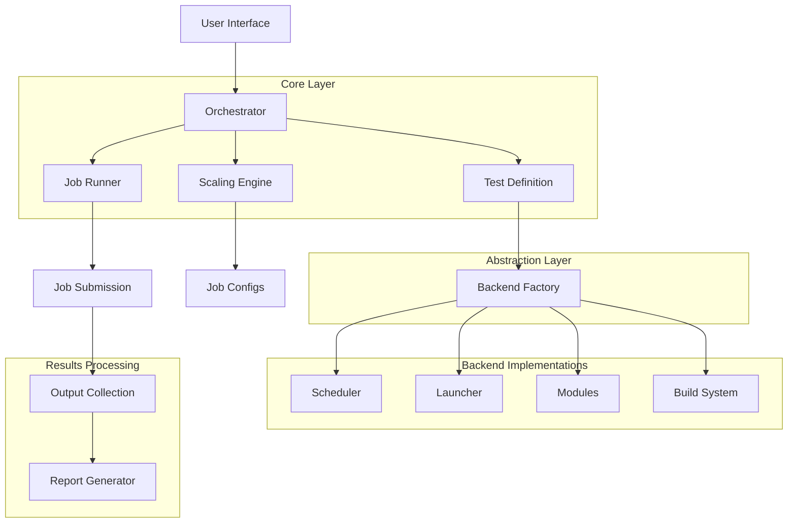

# HPC-ScaleTest

**A modular, production-ready Python framework for automated HPC scaling benchmarks with intelligent workload generation, multi-backend support, and publication-quality performance analysis.**

---

## 📋 About

HPC-ScaleTest is a comprehensive framework designed to simplify and automate the complex process of running scaling studies on High-Performance Computing systems. Whether you're evaluating strong scaling (fixed problem size) or weak scaling (problem size grows with resources), this framework handles:

- **🔄 Automated Workflow**: Clone → Build → Scale → Analyze with a single command
- **🧩 Pluggable Architecture**: Write tests once, run on any HPC system (Slurm, PBS, local)
- **📊 Intelligent Scaling**: Automatic 2D/3D weak scaling with correct incremental dimension growth
- **🎯 Zero Configuration**: Auto-detect build systems, dependencies, and optimal configurations
- **📈 Performance Reports**: Efficiency metrics, speedup analysis, and exportable JSON data
- **🖥️ Heterogeneous Support**: Seamless CPU and GPU resource management

### Key Capabilities

✅ **Minimal User Input**: Provide code repository → Get complete scaling analysis  
✅ **Backend Agnostic**: Same test runs on laptop, cluster, or supercomputer  
✅ **Correct Scaling Logic**: Baseline-preserving 2D/3D weak scaling with validated patterns  
✅ **Smart Build Detection**: Automatically handles Make, CMake, Autotools, Spack, EasyBuild  
✅ **Flexible Job Control**: Auto-submit jobs or generate scripts for manual review  
✅ **Publication Ready**: Export efficiency reports in text and JSON formats  

---

## 🏗️ Architecture & Code Structure

### High-Level Architecture



### Directory Structure

```
hpc-scaletest/
├── core/                      # Core abstractions and configuration
│   ├── abstracts.py          # Abstract base classes (ABCs) for all backends
│   ├── config.py             # Configuration dataclasses
│   ├── factory.py            # Backend factory pattern
│   ├── registry.py           # Plugin registration system
│   └── test_definition.py    # User-facing Test API
│
├── engine/                    # Orchestration and execution logic
│   ├── orchestrator.py       # Main workflow coordinator
│   ├── scaling.py            # Scaling algorithms (strong/weak)
│   ├── runner.py             # Job execution and monitoring
│   └── job_builder.py        # Job script generation
│
├── backends/                  # Pluggable backend implementations
│   ├── schedulers/           # Job schedulers (Slurm, PBS, Local)
│   ├── launchers/            # MPI launchers (srun, mpirun)
│   ├── modules/              # Environment modules (Lmod, Tmod)
│   └── build_systems/        # Build tools (Make, CMake, etc.)
│
├── utils/                     # Utility modules
│   ├── input_processor.py    # Unified input file processing
│   ├── config_manager.py     # Configuration management
│   ├── report_generator.py   # Performance report generation
│   └── system_detector.py    # System configuration detection
│
├── examples/                  # Example configurations
│   ├── run.template.yaml     # Template YAML configuration
│   ├── 2d_weak_scaling.yaml
│   └── 3d_strong_scaling.yaml
│
├── docs/                      # Documentation
│   ├── README.md             # Main documentation
│   ├── GETTING_STARTED.md    # Quick start guide
│   └── YAML_CONFIG_GUIDE.md  # Configuration reference
│
└── hpc_auto.py               # CLI entry point
```

### Component Responsibilities

#### **Core Layer** (`core/`)
- **`abstracts.py`**: Defines interfaces that all backends must implement
- **`test_definition.py`**: User-facing API for defining tests
- **`factory.py`**: Creates appropriate backend instances based on configuration
- **`registry.py`**: Plugin system for custom launchers and backends

#### **Engine Layer** (`engine/`)
- **`orchestrator.py`**: Coordinates entire workflow (acquire → build → scale → analyze)
- **`scaling.py`**: Implements strong/weak scaling algorithms with correct 2D/3D patterns
- **`runner.py`**: Manages job submission, monitoring, and result collection
- **`job_builder.py`**: Generates job scripts with proper SLURM/PBS directives

#### **Backend Layer** (`backends/`)
- **Schedulers**: Submit and monitor jobs on different systems
- **Launchers**: Construct MPI launch commands with proper bindings
- **Modules**: Load environment modules (compilers, libraries)
- **Build Systems**: Compile code using detected or specified build tools

#### **Utilities** (`utils/`)
- **Input Processing**: Parse and modify application input files
- **Configuration**: Load and validate YAML configurations
- **Reporting**: Generate performance analysis reports
- **System Detection**: Auto-detect HPC system characteristics

---

## 🚀 Quick Start

### Installation

```bash
# Clone the repository
git clone https://github.com/yourusername/hpc-scaletest.git
cd hpc-scaletest

# Install dependencies
pip install -r requirements.txt
```

### Usage Overview

HPC-ScaleTest offers three usage modes:

#### **1️⃣ Automated CLI (Fastest)**

Run complete scaling studies with a single command:

```bash
# Strong scaling from local directory
python hpc_auto.py /path/to/my-hpc-app --scaling strong --nodes 16

# Weak scaling from Git repository
python hpc_auto.py https://github.com/user/simulation.git --scaling weak --nodes 32

# With custom configuration
python hpc_auto.py /path/to/code --config examples/run.template.yaml
```

**What happens automatically:**
1. 📥 Acquires source code (local copy or Git clone)
2. 🔍 Analyzes README for build dependencies
3. 🔨 Compiles code with detected build system
4. 📊 Generates scaling configurations (node1, node2, node4, ...)
5. 🚀 Submits jobs to scheduler
6. 📈 Collects results and generates efficiency reports

---

#### **2️⃣ YAML Configuration (Declarative)**

Define tests in YAML for reproducible workflows:

```yaml
# my_test.yaml
repository: /path/to/code
scaling:
  type: weak
  nodes: 16
  scaling_factor: 2
  scaling_dimensions: 2  # 2D: X→Y pattern, 3D: X→Y→Z pattern

hardware:
  type: cpu
  procs_per_node: 112

scheduler: slurm
launcher: srun
partition: standard
account: myproject
time_limit: "01:00:00"
```

```bash
# Run from YAML
python hpc_auto.py --config my_test.yaml
```

**See**: `examples/run.template.yaml` for full configuration options

---

#### **3️⃣ Python API (Advanced Control)**

Programmatic control for custom workflows:

```python
from pathlib import Path
from core.test_definition import Test
from engine.orchestrator import Orchestrator

# Define test
test = Test(
    name="plasma_sim",
    input_file=Path("input.dat"),
    command=["./ipic3d", "input.dat"]
)

# Configure backends
test.set_backend(
    scheduler="slurm",
    launcher="srun",
    module_system="lmod"
)

# Configure resources
test.set_resources(
    max_nodes=64,
    procs_per_node=112,
    partition="gpu",
    account="proj123",
    time_limit="02:00:00"
)

# Configure weak scaling (2D: only X and Y scale)
test.set_scaling(
    scaling_type="weak",
    max_nodes=64,
    scaling_factor=2.0,
    scaling_dimensions=2,  # 2D scaling (X→Y pattern)
    initial_procs=(2, 2, 2),
    initial_domain=(10.0, 10.0, 10.0),
    initial_cells=(128, 128, 128)
)

# Execute workflow
orchestrator = Orchestrator(test=test)
orchestrator.run()
```

---

## 📊 Understanding Scaling Types

### Strong Scaling

**Problem size stays constant, increase parallelism** → Measure speedup

```python
test.set_scaling(
    scaling_type="strong",
    max_nodes=64,
    initial_procs=(2, 2, 2)  # Start with 8 total processes
)
```

**Generated Configuration Pattern:**
```
Node 1:  8 procs,  domain=constant, cells=constant
Node 2: 16 procs,  domain=constant, cells=constant
Node 4: 32 procs,  domain=constant, cells=constant
Node 8: 64 procs,  domain=constant, cells=constant
```

**Metrics Calculated:**
- Speedup = T_baseline / T_current
- Efficiency = (Speedup / Proc_ratio) × 100%

---

### Weak Scaling (2D Mode - Default)

**Problem size grows with resources** → Maintain constant work per process

**❗ Critical: Node 1 is NEVER modified (exact baseline)**

```python
test.set_scaling(
    scaling_type="weak",
    max_nodes=64,
    scaling_factor=2.0,
    scaling_dimensions=2,  # 2D: Only X and Y scale (Z constant)
    initial_procs=(2, 2, 2),
    initial_domain=(10.0, 10.0, 10.0),
    initial_cells=(128, 128, 128)
)
```

**Generated Pattern (2D: X→Y→X→Y):**
```
Node 1:  procs=(2,2,2)    domain=(10,10,10)    [BASELINE - unchanged]
Node 2:  procs=(4,2,2)    domain=(20,10,10)    [X scaled by 2.0]
Node 4:  procs=(4,4,2)    domain=(20,20,10)    [Y scaled by 2.0]
Node 8:  procs=(8,4,2)    domain=(40,20,10)    [X scaled by 2.0]
Node 16: procs=(8,8,2)    domain=(40,40,10)    [Y scaled by 2.0]
```

**Key Rules (2D Mode):**
- ✅ Only X and Y dimensions participate in scaling
- ✅ Z remains constant across all configurations
- ✅ Scaling alternates: X → Y → X → Y → ...
- ✅ Each step multiplies ONLY the active dimension by `scaling_factor`

---

### Weak Scaling (3D Mode)

```python
test.set_scaling(
    scaling_type="weak",
    scaling_dimensions=3,  # 3D: All dimensions scale (X→Y→Z cycle)
    scaling_factor=2.0,
    # ... other parameters
)
```

**Generated Pattern (3D: X→Y→Z→X→Y→Z):**
```
Node 1: procs=(2,2,2)   [BASELINE]
Node 2: procs=(4,2,2)   [X scaled]
Node 4: procs=(4,4,2)   [Y scaled]
Node 8: procs=(4,4,4)   [Z scaled]
Node 16: procs=(8,4,4)  [X scaled]
```

**Metrics Calculated:**
- Efficiency = (T_baseline / T_current) × 100%
- Ideal weak scaling = 100% efficiency (constant time)

---

## 📈 Report Generation

### Automatic Reports

Reports are generated automatically after job completion:

```
output/test_weak_20251114_120000/
├── node1/
├── node2/
├── node4/
├── summary.json
├── WeakScalingReport.txt
└── weak_scaling_report.json
```

### Manual Report Generation

Generate reports from completed test runs:

```bash
# Auto-detect scaling type from directory name
python -m utils.report_generator output/test_weak_20251114_120000

# Explicitly specify scaling type
python -m utils.report_generator output/test_strong_20251114_120000 --scaling strong

# Verbose output
python -m utils.report_generator output/test_weak_20251114_120000 --verbose
```

### Example Report Output

```
================================================================================
Weak Scaling Efficiency Report
================================================================================
Test Name: plasma_sim_weak_20251114_120000
Scaling Type: weak
Nodes Tested: 1, 2, 4, 8, 16

Node | Processes | Time (s) | Efficiency (%) | Speedup
-----|-----------|----------|----------------|--------
   1 |         8 |    60.00 |         100.00 |    1.00
   2 |        16 |    62.00 |          96.77 |    1.94
   4 |        32 |    65.00 |          92.31 |    3.69
   8 |        64 |    70.00 |          85.71 |    6.86
  16 |       128 |    80.00 |          75.00 |   12.00

Summary:
  • Best efficiency: 100.00% (Node 1 - baseline)
  • Worst efficiency: 75.00% (Node 16)
  • Average efficiency: 91.96%
================================================================================
```

---

## 🛠️ Adding New Applications

### 1. Define Variable Mappings

Create a YAML configuration that maps framework parameters to your application's input file variables:

```yaml
# my_app_config.yaml
variable_map:
  length:
    x: "domain_x"
    y: "domain_y"
    z: "domain_z"
  cells:
    x: "nx"
    y: "ny"
    z: "nz"
  mpi_decomposition:
    x: "px"
    y: "py"
    z: "pz"
  particles:
    x: "particles_x"
    y: "particles_y"
    z: "particles_z"
```

### 2. Configure Build System

If your application uses a non-standard build process, specify it in the configuration:

```yaml
build_system: cmake
build_flags:
  CMAKE_BUILD_TYPE: Release
  ENABLE_MPI: ON
```

### 3. Test Integration

Run a small test to verify integration:

```bash
python hpc_auto.py /path/to/my-app --config my_app_config.yaml --nodes 4
```

---

## 🤝 Contributing

We welcome contributions! Please see our [Contributing Guide](docs/CONTRIBUTING.md) for details on:

- Code style guidelines
- Testing procedures
- Pull request process
- Adding new backends

---

## 📄 License

This project is licensed under the MIT License - see the [LICENSE](LICENSE) file for details.

---

## 🙏 Acknowledgments

- HPC community for feedback and testing
- National Supercomputing Centers for access to systems
- Open source community for libraries and tools